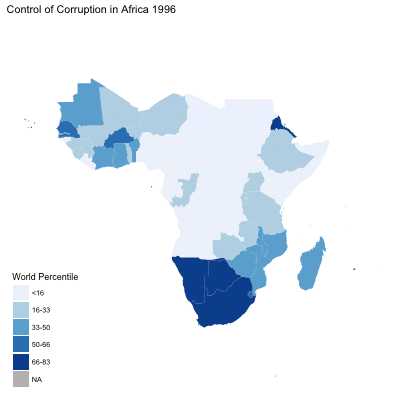

```{r setup, include = FALSE}
#Load necessary libraries
library(tidyverse)
library(knitr)
library(broom)
library(stringr)
library(modelr)
library(forcats)
library(ggmap)
library(rgdal)
library(maps)
library(maptools)
library(readr)
library(tidyr)
library(maptools)
if (!require(gpclib)) install.packages("gpclib", type="source")
gpclibPermit()
library(ggthemes)
library(gganimate)
library(animation)
library(raster)

options(digits = 3)
set.seed(1234)
theme_set(theme_minimal())

#Set global options to hide all messages and warnings 
knitr::opts_chunk$set(
  message = FALSE,
  warning = FALSE,
  echo = FALSE
)
```

#Introduction

In this report, I would like to examine three governance indicators: 1)the rule of law, 2) political stability, and 3)control of corruption, in 48 Sub-Saharan African countries from 1996 to 2016. The dataset is drawn from the World Bank's Governance indicators. The score is measured by the percentile in the world rank.

#1. Import Africa map

```{r}
# Import World map with country borders
world <- readShapeSpatial( "TM_WORLD_BORDERS-0/TM_WORLD_BORDERS-0.3.shp")

# Keep only Africa
Africa <- world[world@data$REGION==2 , ]

# Fortify the map for ggplot use
fortify(Africa) %>%
  head()

# Mutate the id to match World Bank dataset
Africa2 <- Africa %>%
fortify(region = "ISO3") %>%
  as_tibble() %>%
  left_join(Africa@data, by = c("id" = "ISO3"))

```


#2.Import Governance Data from World Bank

```{r}
#import World Bank data
africa_WB <- read_csv("~/Desktop/cfss/hw07/africa_WB.csv")

#tidy data and rename variables
africa_WB_clean <- africa_WB %>%
  rename(Rule_of_Law = "Rule of Law: Percentile Rank [RL.PER.RNK]",
           Anti_Corruption = "Control of Corruption: Percentile Rank [CC.PER.RNK]",
           Gov_Effectiveness = "Government Effectiveness: Percentile Rank [GE.PER.RNK]",
           Pol_Stability = "Political Stability and Absence of Violence/Terrorism: Percentile Rank [PV.PER.RNK]",
           Regulatory = "Regulatory Quality: Percentile Rank [RQ.PER.RNK]",
           Year = "Time",
           country = "Country Code") %>%
  
#Select useful variables
  dplyr::select(Year, 
           country, 
           Rule_of_Law, 
           Anti_Corruption,
           Pol_Stability) %>%
  
#Change variables to numeric
#Divide indicators into 5 intervals 
  mutate(Year = as.numeric(Year), 
         law_cut = cut_interval(
           as.numeric(Rule_of_Law), 5),
         stability_cut  = cut_interval(
           as.numeric(Pol_Stability), 5),
         corruption_cut = cut_interval(
           as.numeric(Anti_Corruption), 5))

```

#3.Rule of Law in Africa

```{r}
africa_WB_clean %>%
#match id column of map with country of dataset
ggplot(aes(map_id = country)) +
  geom_map(aes(fill = law_cut), 
           map = Africa2) +
#Ensure the graph is drawn in a proper window
  expand_limits(x = Africa2$long, 
                y = Africa2$lat) +
  ggthemes::theme_map() +
  labs(title = "Rule of Law in Africa",
       subtitle = "1996-2016",
        fill = NULL) +
#Edit the legend with correct scales
  scale_fill_brewer(name = "World Percentile",
#Use red palette to differentiate 5 levels
                    palette = "Reds",
                    labels = c("<16", "16-32",
                               "32-49", "49-65",
                               "65-82"),
                    na.value = "gray") +
#Fix the map in the correct shape
  coord_fixed(1.3) +
  theme_void()
```

The graph shows the Southern African countries, which include stable democracies such as South Africa and Botswana, are ranked higher (indicated by dark red) in terms of the performance of the rule of law. In addition, coastal countries generally have better legal system than the inland countries (indicated in light red or white). 


#4. Political Stability in Africa

```{r}
africa_WB_clean %>%
#match id column of map with country of dataset
ggplot(aes(map_id = country)) +
  geom_map(aes(fill = stability_cut), 
           map = Africa2) +
#Ensure the graph is drawn in a proper window
  expand_limits(x = Africa2$long, 
                y = Africa2$lat) +
  ggthemes::theme_map() +
  labs(title = "Political Stability in Africa",
       subtitle = "1996-2016",
        fill = NULL) +
#Edit the legend with correct scales
  scale_fill_brewer(name = "World Percentile",
#Use Paired palette to differentiate 5 levels
                    palette = "Paired",
                    labels = c("<18", "18-36",
                               "36-54", "54-72",
                               "72-90"),
                    na.value = "gray") +
#Fix the map in the correct shape
  coord_fixed(1.3) +
  theme_void()
```

The distribution of this map to a certain extent resembles the rule of law map - coastal countries generally have better political stability than inland countries. That means, in Africa, a better legal system tends to correlate with a more stable political enviornment. However, there are exceptions. For instance, South Africa has good rule of law, but wansn't politically stable (<36th percentile) during 1996 - 2006.


#5. Control of Corruption in Africa

```{r}
#match id column of map with country of dataset
corruption_year <- ggplot(africa_WB_clean, 
                          aes(map_id = country, 
                              frame = Year)) +
  geom_map(aes(fill = corruption_cut), 
           map = Africa2) +
#Ensure the graph is drawn in a proper window
  expand_limits(x = Africa2$long, 
                y = Africa2$lat) +
  labs(title = "Control of Corruption in Africa",
        fill = NULL) +
#Edit the legend with correct scales
  scale_fill_brewer(name = "World Percentile",
                    palette = "Blues", 
                    na.value = "gray",
                    labels = c("<16", "16-33",
                               "33-50", "50-66",
                               "66-83")) +
  ggthemes::theme_map()

#Use gganimate to show changes from 1996 to 2016 
corr <- gganimate(corruption_year)

#Save the animation in gif to show properly on knit
gganimate_save(corr, "corruption.gif", 
               ani.width = 400, 
               ani.height = 400)
```



This animated graph shows the control of corruption in African countries has generally worsened from 1996 to 2016. For instance, in 1996, quite a few Southern and North-western African countries were ranked at 66th - 83th percentiles for their anti-corruption efforts. But in 2016, only one country (Zimbabwe) was ranked at the same level. Inland African countries are stably ranked with very poor control of corruption.
