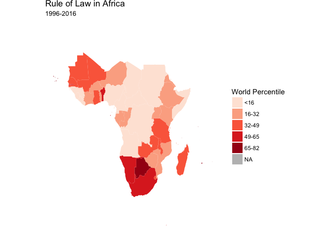
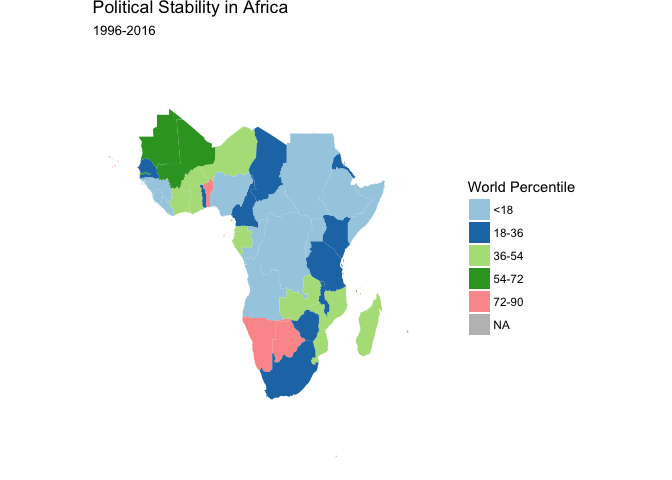

Hw07\_map
================
Hy Mak
5/14/2018

Introduction
============

In this report, I would like to examine three governance indicators: 1)the rule of law, 2) political stability, and 3)control of corruption, in 48 Sub-Saharan African countries from 1996 to 2016. The dataset is drawn from the World Bank's Governance indicators. The score is measured by the percentile in the world rank.

1.Import Africa map
===================

2.Import Governance Data from World Bank
========================================

3.Rule of Law in Africa
=======================

The graph shows the Southern African countries, which include stable democracies such as South Africa and Botswana, are ranked higher (indicated by dark red) in terms of the performance of the rule of law. In addition, coastal countries generally have better legal system than the inland countries (indicated in light red or white).

4.Political Stability in Africa
===============================

The distribution of this map to a certain extent resembles the rule of law map - coastal countries generally have better political stability than inland countries. That means, in Africa, a better legal system tends to correlate with a more stable political enviornment. However, there are exceptions. For instance, South Africa has good rule of law, but wansn't politically stable (&lt;36th percentile) during 1996 - 2006.

5.Control of Corruption in Africa
=================================

This animated graph shows the control of corruption in African countries has generally worsened from 1996 to 2016. For instance, in 1996, quite a few Southern and North-western African countries were ranked at 66th - 83th percentiles for their anti-corruption efforts. But in 2016, only one country (Zimbabwe) was ranked at the same level. Inland African countries are stably ranked with very poor control of corruption.
