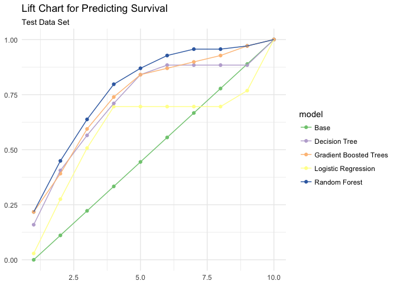
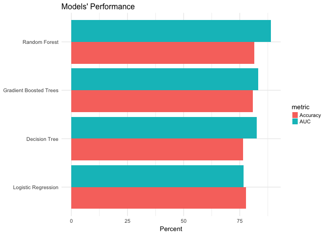

Hw07\_spark
================
Hy Mak
5/13/2018

1. Connect to Spark and Read Titanic Data
=========================================

``` r
#Connect to remote Spark cluster
sc <- spark_connect(master = "local")

#Load Titanic data frame
titanic_tbl <- copy_to(sc, titanic_train, "titanic", overwrite = TRUE)

#Mutate variables to fit in dataframe
titanic_final <- titanic_tbl %>% 
  mutate(Pclass = as.character(Pclass),
         Fare = if_else(is.na(Fare), 
                        mean(Fare), Fare),
         Survived = as.numeric(Survived)) %>%
  filter(!is.na(Age)) %>%
#Store the table in Spark cluster
  sdf_register("titanic_final")
```

2. Build the Model: Gender, Fare, Pclass, Age
=============================================

``` r
#Partition the data
partition <- titanic_final %>%
#Create the strongest model I built last time
  select(Survived, Pclass, Sex, Age, Fare) %>%
  sdf_partition(train = 0.75, test = 0.25, seed = 1234)

#Create table references
train_tbl <- partition$train
test_tbl <- partition$test
```

3. Test the model using 4 algorithms in Sparklyr
================================================

``` r
# The base model
ml_formula <- formula(Survived ~ Pclass + Sex + Age + Fare)

# Train the logistic regression model
ml_log <- ml_logistic_regression(train_tbl, ml_formula)

# Decision Tree algorithm
ml_dt <- ml_decision_tree(train_tbl, ml_formula)

# Random Forest algorithm
ml_rf <- ml_random_forest(train_tbl, ml_formula)

# Gradient Boosted Tree algorithm
ml_gbt <- ml_gradient_boosted_trees(train_tbl, ml_formula)

#Bundle the models into a single list object
ml_models <- list(
  "Logistic Regression" = ml_log,
  "Decision Tree" = ml_dt,
  "Random Forest" = ml_rf,
  "Gradient Boosted Trees" = ml_gbt
)

# Create a function for scoring
score_test_data <- function(model, data = test_tbl){
  pred <- sdf_predict(model, data)
  select(pred, Survived, prediction)
}

# Score all the models
ml_score <- map(ml_models, score_test_data)
```

4. Compare algorithms: Which one is the best?
=============================================

``` r
# Lift function
calculate_lift <- function(scored_data) {
  scored_data %>%
    mutate(bin = ntile(desc(prediction), 10)) %>% 
    group_by(bin) %>% 
    summarize(count = sum(Survived)) %>% 
    mutate(prop = count / sum(count)) %>% 
    arrange(bin) %>% 
    mutate(prop = cumsum(prop)) %>% 
    select(-count) %>% 
    collect() %>% 
    as.data.frame()
}

# Initialize results
ml_gains <- data_frame(
  bin = 1:10,
  prop = seq(0, 1, len = 10),
  model = "Base"
)

# Calculate lift score
for(i in names(ml_score)){
  ml_gains <- ml_score[[i]] %>%
    calculate_lift %>%
    mutate(model = i) %>%
    bind_rows(ml_gains, .)
}

as_tibble(ml_gains)
```

    ## # A tibble: 50 x 3
    ##      bin  prop model
    ##    <int> <dbl> <chr>
    ##  1     1 0.    Base 
    ##  2     2 0.111 Base 
    ##  3     3 0.222 Base 
    ##  4     4 0.333 Base 
    ##  5     5 0.444 Base 
    ##  6     6 0.556 Base 
    ##  7     7 0.667 Base 
    ##  8     8 0.778 Base 
    ##  9     9 0.889 Base 
    ## 10    10 1.00  Base 
    ## # ... with 40 more rows

``` r
# Plot the results
ggplot(ml_gains, aes(x = bin, y = prop, color = model)) +
  geom_point() +
  geom_line() +
  scale_color_brewer(type = "qual") +
  labs(title = "Lift Chart for Predicting Survival",
       subtitle = "Test Data Set",
       x = NULL,
       y = NULL)
```



### Analysis:

The lift chart indicates that the random forest method generates the best prediction among all algorithms.

5.Calculate accuracy and AUC metrics
====================================

``` r
# Function for calculating accuracy
calc_accuracy <- function(data, cutpoint = 0.5){
  data %>% 
    mutate(prediction = if_else(prediction > cutpoint, 1.0, 0.0)) %>%
    ml_classification_eval("prediction", "Survived", "accuracy")
}

# Calculate AUC and accuracy
perf_metrics <- data_frame(
  model = names(ml_score),
  AUC = 100 * map_dbl(ml_score, ml_binary_classification_eval, "Survived", "prediction"),
  Accuracy = 100 * map_dbl(ml_score, calc_accuracy)
  )
perf_metrics
```

    ## # A tibble: 4 x 3
    ##   model                    AUC Accuracy
    ##   <chr>                  <dbl>    <dbl>
    ## 1 Logistic Regression     76.7     77.8
    ## 2 Decision Tree           82.5     76.5
    ## 3 Random Forest           88.8     81.5
    ## 4 Gradient Boosted Trees  83.2     80.9

``` r
# Plot results
gather(perf_metrics, metric, value, AUC, Accuracy) %>%
  ggplot(aes(reorder(model, value), value, 
             fill = metric)) + 
  geom_bar(stat = "identity", position = "dodge") + 
  coord_flip() +
  theme_minimal(base_size = 10) +
  theme(legend.key.size = unit(0.35, "cm")) +
  labs(title = "Models' Performance",
       x = NULL,
       y = "Percent")
```



### Analysis:

The random forest model performs the best. The plot shows it has the strongest accuracy and AUC metrics among all algorithms.
