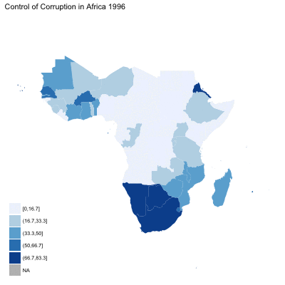

# Governance in Africa

This report analyses three governance indicators in 48 Sub-Saharan African countries from 1996 to 2016:

1) The rule of law

2) Political stability 

3) Control of corruption

The source of data is the World Bank's Governance indicators database. The score indicates the percentile of a country's ranking in the world.

For the md file (without codes) for the Map of Governance in Africa 1996 - 2016), please click
[here](Hw07_map.md).

For the raw codes please click [here](Hw07_map.Rmd).

